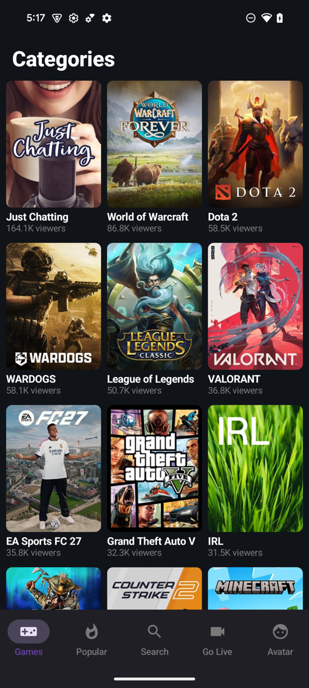
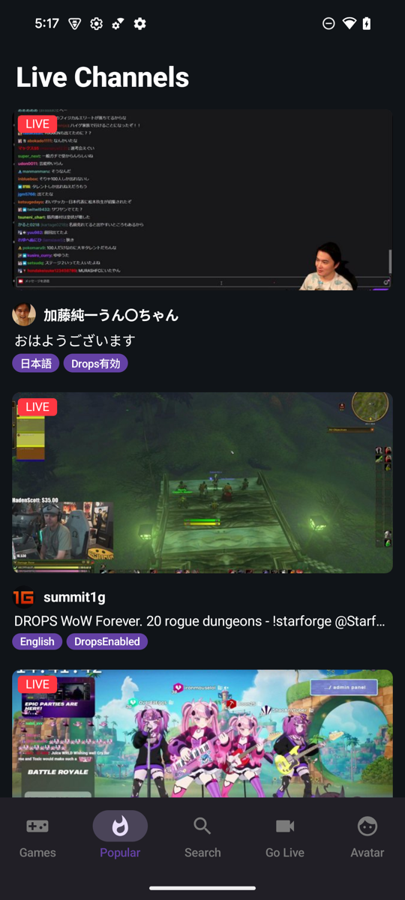
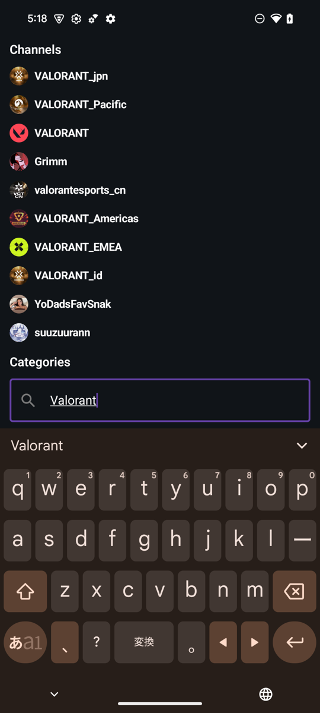
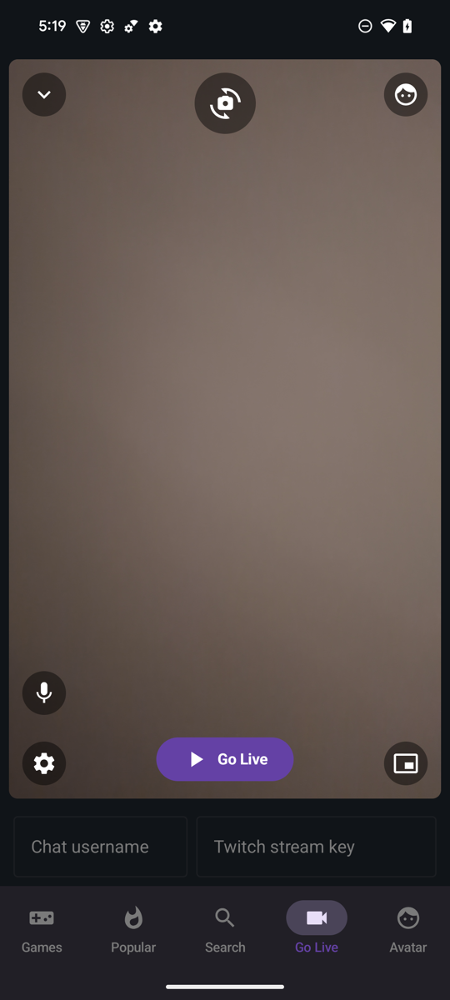
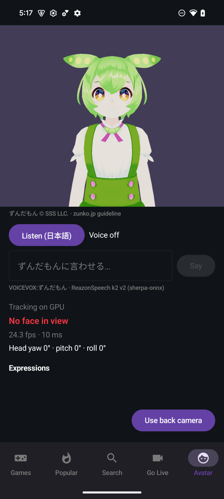
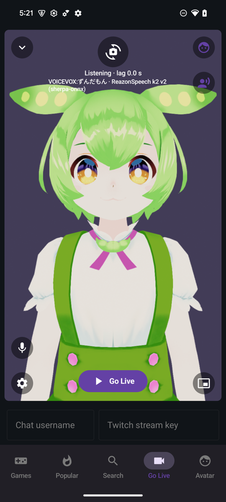
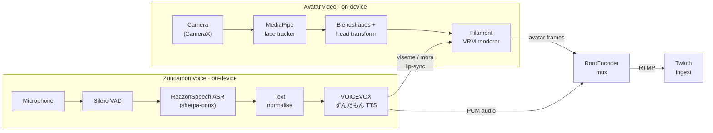

# VirtualTwitchDroid

A multi-module Jetpack Compose Android app that clones a Twitch-style streaming client and adds a fully
**on-device VTuber toolchain**: browse live channels, watch with chat, **broadcast to Twitch RTMP**, and go
live as a **face-tracked VRM avatar** speaking with an **on-device Japanese voice changer** — no cloud, no
server. Built on the [Now in Android](https://github.com/android/nowinandroid) architecture (Gradle
`build-logic` convention plugins + Hilt + MVVM). **Almost the entire project — code, tests and docs —
was developed by [Claude](https://claude.com/claude-code) (Anthropic's Claude Code) driving the local
AI development loop described below.**

> Personal, non-commercial learning project. Not affiliated with Twitch. See **[LICENSES.md](LICENSES.md)**.

## Screenshots

| Games | Popular | Search | Go Live | Avatar |
|:---:|:---:|:---:|:---:|:---:|
|  |  |  |  |  |
| Live categories | Live channels + chat | Channel / category search | Camera → RTMP broadcast | Face-tracked VRM avatar |

*Captured on a Pixel 8a. Going live as the VTuber avatar with the Zundamon voice is shown [below](#going-live-as-a-vtuber-avatar--voice).*

## Features

The bottom navigation has five tabs: **Games · Popular · Search · Go Live · Avatar**.

| Tab / area | What it does | Module |
|---|---|---|
| **Games / Popular / Search** | Browse live channels and categories from real Twitch data (GraphQL). | [`:feature:browse`](feature/browse/README.md) |
| **Watch** | Play a channel's live HLS stream (media3/ExoPlayer) with Xtra-style controls, PiP, fullscreen, and real IRC chat over WebSocket. | [`:feature:stream`](feature/stream/README.md) |
| **Go Live** | Broadcast the camera to Twitch RTMP ([RootEncoder](https://github.com/pedroSG94/RootEncoder)); overlay for mic mute, quality, PiP, and the VTuber / Zundamon-voice toggles. | [`:feature:publish`](feature/publish/README.md) |
| **Avatar** | A face-tracked **VRM** avatar rendered with Filament, driven by MediaPipe blendshapes; VTuber mode broadcasts the avatar instead of the camera. Includes a voice rehearsal card. | [`:feature:avatar`](feature/avatar/README.md) |
| **Voice** | On-device Japanese **voice changer**: mic → VAD + ASR → text → VOICEVOX ずんだもん TTS → lip-synced avatar + broadcast audio. | [`:feature:voice`](feature/voice/README.md) |

## Going live as a VTuber (avatar + voice)



The **Go Live** screen broadcasts to Twitch over RTMP. You can replace the camera feed with the
face-tracked Zundamon avatar and speak through the on-device Japanese voice changer — both are
rendered/processed on the phone and encoded into the same outgoing stream, with no server.

1. **Open Go Live** (bottom navigation) and grant camera + microphone when prompted; the camera
   preview appears.
2. **Enter your Twitch stream key** (and an optional chat username) in the fields under the preview.
   The key goes only to Twitch's RTMP ingest and is never stored.
3. **Turn on the avatar** — tap the face icon at the top-right ("Broadcast the avatar (VTuber
   mode)"). The preview swaps the camera for the 3D VRM avatar on a purple background and the icon
   turns purple. The avatar mirrors your head pose and expressions via MediaPipe face tracking.
4. **Turn on the voice** — a voice icon appears directly below the face toggle ("Speak with the
   Zundamon voice"). Tap it; it turns purple and an overlay shows
   `Listening · VOICEVOX:ずんだもん · ReazonSpeech k2 v2 (sherpa-onnx)`. Speak Japanese: the avatar
   lip-syncs and the Zundamon voice is mixed into the broadcast audio.
5. **Tap "Go Live"** to start streaming. Use the top-left chevron to minimize into a floating
   window, or the bottom-right button for system picture-in-picture; the mic and quality controls
   sit at the bottom-left.



When VTuber mode is on, the camera feeds face-tracking only and the **rendered avatar** becomes the
broadcast video; when the voice is on, the **synthesized Zundamon audio** (not the raw mic) becomes
the broadcast audio, and its viseme track drives the avatar's mouth. Both meet at RootEncoder, which
muxes them into the single RTMP stream.

**Pipeline:** camera → MediaPipe face landmarks → Filament VRM render → RootEncoder video; and
mic → Silero VAD + ReazonSpeech ASR (sherpa-onnx) → VOICEVOX ずんだもん TTS → RootEncoder audio +
avatar mouth lip-sync. Details in [`:feature:publish`](feature/publish/README.md),
[`:feature:avatar`](feature/avatar/README.md) and [`:feature:voice`](feature/voice/README.md).

> The Zundamon voice shows the mandatory 「VOICEVOX:ずんだもん」credit at runtime. Keep use
> non-commercial; see **[LICENSES.md](LICENSES.md)**.

## Architecture

```
build-logic/convention        Convention plugins: virtualtwitchdroid.android.{application,library,feature}[.compose],
                              virtualtwitchdroid.hilt, virtualtwitchdroid.jvm.library
:app                          @HiltAndroidApp Application, MainActivity, NavHost + bottom navigation
:core:model                   Pure-Kotlin domain models
:core:common                  Dispatchers, coroutine qualifiers, shared media seams (SpeechStreamSource, MouthTrackSource, PcmSink)
:core:designsystem            Material 3 theme + design tokens (Color/Type/Shape/Spacing/IconSize/Sizing/Elevation/Motion)
:core:network                 OkHttp + Retrofit + kotlinx.serialization (Twitch GraphQL + IRC-over-WebSocket)
:core:data                    Repositories (interface + @Binds impl)
:core:testing                 Shared fakes and test rules
:feature:browse               Games / Popular / Search live-channel browsing
:feature:stream               Watch player + live chat
:feature:publish              Camera → RTMP broadcast, PiP, VTuber/voice toggles
:feature:avatar               Face-tracked VRM VTuber avatar (MediaPipe + Filament)
:feature:voice                On-device Japanese voice changer (sherpa-onnx ASR + VOICEVOX TTS + lip-sync)
```

Each module has its own `README.md` (linked in the table above; core modules under `core/*/README.md`).

## Tech stack

Kotlin 2.3.21 · AGP 9.3.2 / Gradle 9.5 · Jetpack Compose (BOM 2026.09) + Material 3 · Hilt 2.60.1 · media3 1.11 ·
CameraX · RootEncoder 2.8.1 · MediaPipe Tasks 0.10.35 · Filament 1.76.1 · sherpa-onnx 1.13.8 · VOICEVOX CORE
0.17.0. Full attributions and licenses: **[LICENSES.md](LICENSES.md)**.

## Build & run

Requirements: Android Studio with **JDK 25** (the Android Studio JBR), an arm64 device or the x86_64 emulator,
and **[Git LFS](https://git-lfs.com/)** (the repo tracks large model binaries — the ASR encoder alone is ~148 MB).

```bash
git lfs install && git clone <your-fork-url> && cd VirtualTwitchDroid
./gradlew :app:installDebug   # all assets are bundled (Git LFS) — no extra downloads
```

`scripts/ai-dev-loop.sh` runs the full local gate (unit → Spotless → Lint → build → install → instrumented UI).

### Assets & Git LFS

All model and character assets are **committed** (large binaries via Git LFS), so a fresh clone builds and
runs with no extra downloads — including the Zundamon VRM and the VOICEVOX `0.vvm`. Their terms permit
embedding in a redistributed, non-commercial application with the 「VOICEVOX:ずんだもん」credit shown at
runtime; see **[LICENSES.md](LICENSES.md)**. Keep the project **non-commercial**, and run `git lfs install`
before cloning/pushing.

## Twitch data

Browsing, watching and chat use public Twitch endpoints and need no account. Going live needs **your own Twitch
stream key** (entered in the Go Live screen); it is never stored or sent anywhere but Twitch's RTMP ingest.

## AI-assisted development

This app is built with a local, CI-free AI development loop: a request becomes a tiny spec and the
smallest change, is gated by `scripts/ai-dev-loop.sh`, then verified on a real device with
[**ARTEMIS**](https://github.com/google/artemis) — an autonomous mobile UI agent driven over MCP — before being reported. The
screenshots above were captured through that loop on a Pixel 8a.

- **Claude Code setup (`.claude/`)** — [`.claude/README.md`](.claude/README.md): the slash
  commands, the skills, and how to set up the loop on a fresh clone.
- **Scripts & how to run them** — [`scripts/README.md`](scripts/README.md).
- **The full process guide (how it combines with ARTEMIS)** — [`docs/AI_DEVELOPMENT.md`](docs/AI_DEVELOPMENT.md).
- **Project home** — <https://github.com/JinRong1125/VitrualTwitchDroid>.

There is no CI in this project: the device-backed gate plus the ARTEMIS journeys in
[`scripts/artemis-journeys.md`](scripts/artemis-journeys.md) are the quality bar. A fresh clone
carries no personal config — connect your own Android device, add your own ARTEMIS/LLM credentials
(never committed), and the same loop runs locally. Setup steps are in
[`.claude/README.md`](.claude/README.md).

## References

GitHub repositories this project was developed with — its architecture and UI inspiration, the
libraries and on-device models it uses, its tooling, and the research that informed the avatar and
voice features. Full licenses and attributions are in **[LICENSES.md](LICENSES.md)**.

**Architecture & UI inspiration**
- [android/nowinandroid](https://github.com/android/nowinandroid) — module architecture + `build-logic`.
- [skydoves/twitch-clone-compose](https://github.com/skydoves/twitch-clone-compose) — Twitch-style UI.
- [crackededed/Xtra](https://github.com/crackededed/Xtra) — watch/chat interaction patterns.

**Streaming, camera & rendering**
- [pedroSG94/RootEncoder](https://github.com/pedroSG94/RootEncoder) — RTMP camera/avatar broadcast.
- [google/filament](https://github.com/google/filament) — VRM/glTF rendering.

**On-device ML & voice**
- [google-ai-edge/mediapipe](https://github.com/google-ai-edge/mediapipe) — face landmarks / blendshapes.
- [k2-fsa/sherpa-onnx](https://github.com/k2-fsa/sherpa-onnx) — ASR + VAD runtime.
- [snakers4/silero-vad](https://github.com/snakers4/silero-vad) — voice activity detection.
- [VOICEVOX/voicevox_core](https://github.com/VOICEVOX/voicevox_core) — Japanese TTS engine.
- [VOICEVOX/voicevox_vvm](https://github.com/VOICEVOX/voicevox_vvm) — the ずんだもん voice model (`0.vvm`).
- [VOICEVOX/onnxruntime-builder](https://github.com/VOICEVOX/onnxruntime-builder) — the bundled ONNX Runtime.

**Libraries**
- [square/retrofit](https://github.com/square/retrofit) — Twitch GraphQL/HTTP client.
- [coil-kt/coil](https://github.com/coil-kt/coil) — image loading.
- [cashapp/turbine](https://github.com/cashapp/turbine) — Flow testing.

**Tooling & AI development**
- [google/artemis](https://github.com/google/artemis) — the mobile UI agent used to verify on device.
- [diffplug/spotless](https://github.com/diffplug/spotless) · [pinterest/ktlint](https://github.com/pinterest/ktlint) — formatting.

**VTuber / VRM research (informed the avatar & voice design)**
- [vrm-c/vrm-specification](https://github.com/vrm-c/vrm-specification) · [madjin/vrm-samples](https://github.com/madjin/vrm-samples) — VRM format + test models.
- [yeemachine/kalidokit](https://github.com/yeemachine/kalidokit) · [ButzYung/SystemAnimatorOnline](https://github.com/ButzYung/SystemAnimatorOnline) — face-tracking-to-rig references.
- [Open-LLM-VTuber/Open-LLM-VTuber](https://github.com/Open-LLM-VTuber/Open-LLM-VTuber) · [notvalproate/zundamon-vc](https://github.com/notvalproate/zundamon-vc) — VTuber / Zundamon voice-changer references.

**Project home** — [JinRong1125/VitrualTwitchDroid](https://github.com/JinRong1125/VitrualTwitchDroid).

## License

The **application source code** in this repository is licensed under the **MIT License** — see
**[LICENSE](LICENSE)**. All **third-party** code, models and assets keep their own licenses, attributed in
**[LICENSES.md](LICENSES.md)**.
